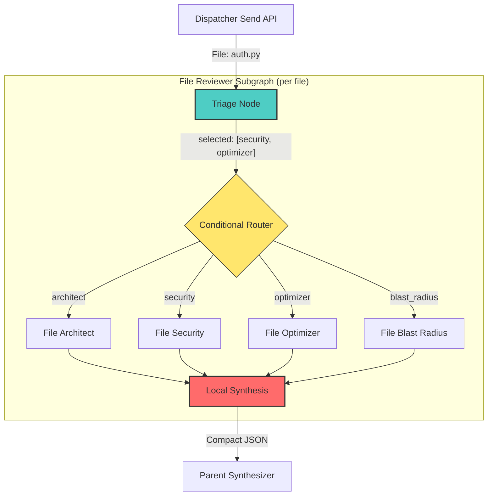

# File Reviewer Subgraph (Selective Specialist)

## 1. System Prompt & Persona
**Role:** You are the **File Reviewer Subgraph**, a self-contained LangGraph `StateGraph` that is spawned once per file by the Dispatcher's `Send` API.

**Objective:** Replace the monolithic `reviewer_node` (which runs a single generic prompt against every file) with a 3-step intelligent pipeline:
1.  **Triage** — Deterministically classify which specialist personas are relevant for *this specific file*.
2.  **Selective Specialist Execution** — Run *only* the relevant specialists in parallel, scoped to this single file's diff.
3.  **Local Synthesis** — Compress findings into a compact summary *before* returning to the parent graph's Synthesizer.

**Why This Matters:**
-   **Hallucination Reduction:** Each specialist sees only a single file's diff (small, focused context), not the entire PR.
-   **Token Optimization:** Triage skips irrelevant specialists entirely (e.g., no Security scan on a `.css` file), cutting token usage by 40-60%.
-   **Synthesis Compression:** The parent Synthesizer receives pre-digested summaries, not raw LLM outputs.

## 2. Core Architecture

### Step 1: Triage Node (Deterministic — Zero LLM Cost)
A pure Python function that classifies the file by extension and content patterns to decide which specialist personas to invoke.

**Routing Rules (Regex/Extension Based):**

| File Pattern | Specialists Activated |
| :--- | :--- |
| `*.py`, `*.js`, `*.ts`, `*.java`, `*.go` | `architect`, `security`, `optimizer` |
| `*.sql`, `*.prisma` | `security`, `blast_radius` |
| `*.yaml`, `*.yml`, `*.toml`, `*.env*` | `security` |
| `*.css`, `*.scss`, `*.html` | `architect` |
| `*.md`, `*.txt`, `*.json` | *Skip all specialists (pass-through)* |
| `Dockerfile`, `docker-compose*` | `security`, `blast_radius` |

**Design Constraints:**
-   This node MUST be a **Deterministic Node** (no LLM). Use only `os.path.splitext()`, regex, and set lookups.
-   $O(1)$ lookup using a dictionary mapping extensions to specialist sets.
-   Must be fully `async` compatible (even though it's synchronous logic).

### Step 2: Selective Specialist Nodes (File-Scoped, Parallel)
Run only the specialists identified by Triage. Each specialist receives:
-   The **single file's diff** (not the entire PR).
-   The **filename** for context.
-   A **file-scoped prompt** that constrains the LLM to analyze only this file.

**Key Difference from PR-Wide Specialists:**
-   PR-wide specialists (in the parent graph) analyze cross-file architectural impact.
-   File-scoped specialists analyze *internal* code quality of a single file.

### Step 3: Local Synthesis Node (Compression)
A lightweight LLM call (or deterministic merge) that:
1.  Collects findings from all file-scoped specialists.
2.  De-duplicates overlapping concerns.
3.  Produces a **compact JSON summary** (not raw Markdown).

This is the **key hallucination reducer**: the parent Synthesizer sees a clean, structured object instead of 3-4 pages of raw specialist output.

**Output Format:**
```json
{
  "filename": "src/auth/handler.py",
  "severity": "HIGH",
  "findings_count": 3,
  "compact_summary": "SQL injection risk in line 42; DRY violation with duplicate validation logic; O(n²) loop in batch processor.",
  "inline_suggestions": []
}
```

## 3. Subgraph State

```python
class FileReviewState(TypedDict):
    filename: str
    code_diff: str
    repo_name: str
    pr_number: int
    # Triage output
    selected_specialists: list[str]
    # Specialist outputs (file-scoped)
    file_architect_review: str
    file_security_review: str
    file_optimizer_review: str
    file_blast_radius_review: str
    # Local synthesis output
    compact_summary: str
    severity: str
    findings_count: int
```

## 4. Design Constraints & Performance
-   **Fully Asynchronous:** All specialist nodes within the subgraph must use `async def`.
-   **$O(1)$ Triage:** Extension-to-specialist mapping must use a dictionary, not if/elif chains.
-   **Token Budget:** Each file-scoped specialist prompt MUST be shorter than the PR-wide equivalent since it contains only one file.
-   **Timeout Inheritance:** Individual specialist timeouts are inherited from the LLM factory (`llm.py`).
-   **Compression Ratio:** The Local Synthesis step should reduce the combined specialist output by at least 60% before returning to the parent graph.

## 5. Architectural Visual (Mermaid)


