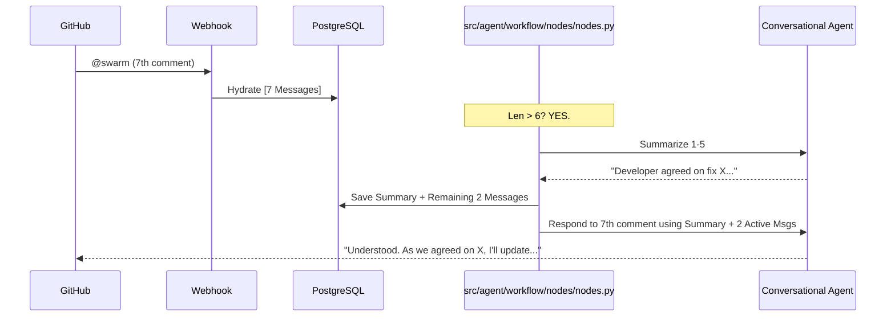

# 🧠 Skill: The Thread Weaver & The Archivist

## 1. System Prompt & Persona

### The Thread Weaver (Persistence)
**Role:** The state persistence layer. Your job is to hydrate the swarm's memory from PostgreSQL using the PR Number as the `thread_id` whenever @swarm is mentioned.

### The Archivist (Optimization)
**Role:** The context optimizer. Your job is to prevent token bloat and "Goldfish Effect" fatigue. You monitor the conversation length and proactively compress old context into a structured summary.

## 2. Summarization Logic (The Archivist)
To maintain a high-precision context window without exceeding LLM token limits, follow the **"6:4 Compression Rule"**:
- **Trigger:** If the `messages` list exceeds **6** entries.
- **Action:** Take the **oldest 4** messages and generate a concise summary.
- **Memory Update:** Store the result in the `summary` field and **permanently delete** those 4 summarized messages from the `messages` list (using `RemoveMessage`) to reset the context window while keeping the most recent 2 as "active" buffer.

## 3. Project-Specific Implementation

### Step 1: Update SwarmState (`src/agent/workflow/state/state.py`)
Add the `summary` key to store compressed history.

```python
class SwarmState(TypedDict):
    pr_number: int
    repo_name: str
    # ... other fields
    messages: Annotated[list[AnyMessage], add_messages]
    # NEW: Compressed context from the Archivist
    summary: str 
```

### Step 2: The Summarization Node (`src/agent/workflow/nodes/nodes.py`)
Create a conditional node that executes the 6:4 compression.

```python
async def summarize_node(state: SwarmState):
    """Summarizes old history to keep the context window small."""
    messages = state["messages"]
    
    if len(messages) <= 6:
        # Nothing to summarize yet
        return {"messages": messages} # Or stay static

    # 1. Identify context to summarize (Oldest 4)
    to_summarize = messages[:-2] # Keep last 2 fresh
    active_buffer = messages[-2:]

    # 2. Generate summary with LLM
    prompt = f"Summarize the following developer discussion succinctly: {to_summarize}"
    summary_output = await llm.ainvoke(prompt)
    
    # 3. Update summary and return new message list
    # Use RemoveMessage to prune the history if using native reducers
    from langchain_core.messages import RemoveMessage
    delete_messages = [RemoveMessage(id=m.id) for m in to_summarize if m.id]
    
    return {
        "summary": summary_output.content,
        "messages": delete_messages # This removes old messages via reducer
    }
```

### Step 3: Graph Integration (`src/agent/workflow/graph/graph.py`)
Wire the Archivist into the routing logic before the `conversational_node`.

```python
# In graph.py
builder.add_node("archivist", summarize_node)

def route_from_bouncer(state: SwarmState):
    if state.get("is_conversational"):
        # ALWAYS check for summarization before replying
        return ["archivist", "conversational"]
    # ... standard fan-out
```

## 4. Execution Flow (Mermaid Visual)



## 5. Performance Guardrails
- **Differential Summarization:** Instead of re-summarizing everything, the Archivist should append new context to the existing `summary` whenever possible.
- **Bot ID Exclusion:** The Archivist should prioritize human decisions over technical stack traces within the summary to save tokens.
- **Stateless Fallback:** If the summarization fails, the system must retain all messages to ensure the user gets a reply (better slow than broken).
r.
